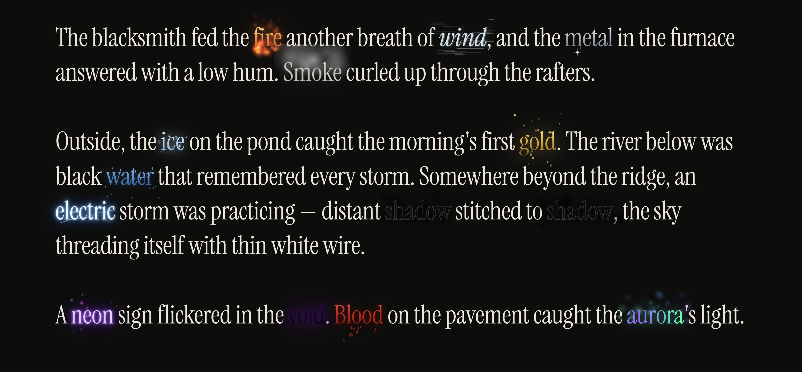

# elemental-input

Animated effect text field for React. Type magic words to trigger **fire**, **water**, **ice**, and 10 more live particle effects.



## Install

```bash
npm install elemental-input
```

## Usage

```tsx
import { EffectTextField } from 'elemental-input';
import 'elemental-input/style.css';

function App() {
  const [text, setText] = useState('');

  return (
    <EffectTextField
      value={text}
      onChange={setText}
      placeholder="Type fire, water, ice…"
      style={{ height: 400 }}
    />
  );
}
```

## Props

| Prop | Type | Default | Description |
|------|------|---------|-------------|
| `wordEffects` | `Record<string, EffectType>` | — | Custom word → effect mappings (merged with defaults) |
| `enableDefaultEffects` | `boolean` | `true` | Auto-map the 13 built-in magic words |
| `value` | `string` | — | Controlled value |
| `defaultValue` | `string` | `''` | Uncontrolled initial value |
| `onChange` | `(value: string) => void` | — | Change handler |
| `placeholder` | `string` | — | Placeholder text |
| `forceFieldRadius` | `number` | `310` | Mouse repulsion radius (px) |
| `forceFieldStrength` | `number` | `90` | Mouse repulsion strength |
| `particleDensity` | `number` | `0.3` | Particle spawn multiplier |
| `enableJitter` | `boolean` | `true` | Blur words inside the force field |

## Built-in effects

`fire` · `smoke` · `metal` · `wind` · `water` · `ice` · `shadow` · `gold` · `electric` · `neon` · `blood` · `void` · `aurora`

## Custom word mapping

```tsx
<EffectTextField
  wordEffects={{
    storm:    'electric',
    love:     'gold',
    night:    'void',
    ocean:    'water',
  }}
/>
```

Set `enableDefaultEffects={false}` to use only your own mappings.

## Adding a custom effect

Each effect lives in its own file and implements `EffectDefinition`. Register it once at app startup:

```tsx
import { registerEffect } from 'elemental-input';

registerEffect('rainbow', {
  spawnRate: 1.5,
  additive: true,

  newParticle(w, h) {
    const r = Math.random;
    return {
      x: w * r(), y: h * r(),
      vx: (r() - 0.5) * 0.3, vy: -0.3 - r() * 0.5,
      life: 0, max: 50 + r() * 30, size: 2 + r() * 3,
    };
  },

  drawParticle(ctx, p, t) {
    const hue = (p.x / ctx.canvas.width) * 360;
    const a   = (1 - t) * 0.8;
    ctx.fillStyle = `hsla(${hue},100%,65%,${a})`;
    ctx.beginPath();
    ctx.arc(p.x, p.y, p.size, 0, Math.PI * 2);
    ctx.fill();
  },
});
```

Then use it in your mapping:

```tsx
<EffectTextField wordEffects={{ magic: 'rainbow' }} />
```

## License

MIT © [Khoa Pham](mailto:onmyway133@gmail.com)
